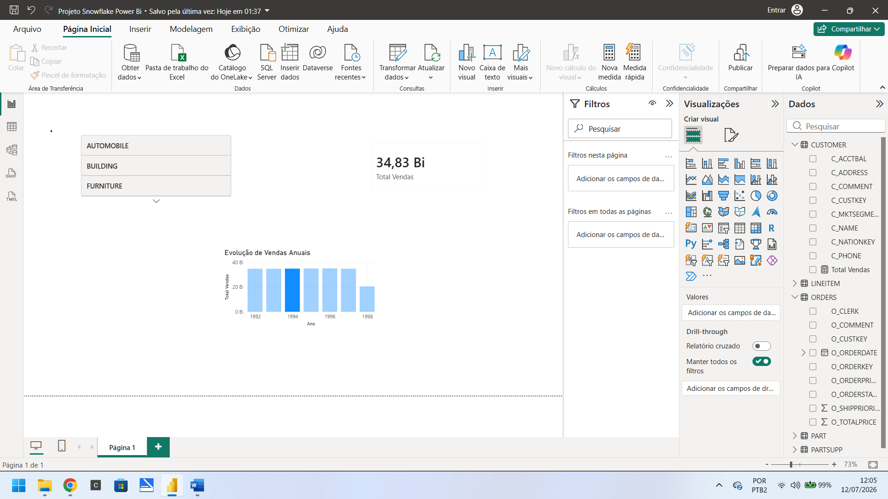

# Projeto: Pipeline de Dados & Análise Estratégica (Olist)

## 🎯 Objetivo
Este projeto foi desenvolvido para demonstrar habilidades em engenharia e análise de dados, utilizando a arquitetura **Medallion** (Bronze, Silver, Gold) para processar dados de e-commerce e gerar indicadores de negócio (KPIs).

## 🛠️ Tecnologias Utilizadas
- **Snowflake:** Armazenamento e processamento de dados em nuvem.
- **SQL:** Limpeza, transformação e modelagem dos dados.
- **Power BI:** Visualização de dados e criação de dashboards.

## 🏗️ Arquitetura do Projeto
- **Camada Bronze:** Ingestão dos dados brutos.
- **Camada Silver:** Limpeza e padronização.
- **Camada Gold:** Modelagem dimensional e criação de views analíticas.

## 📊 KPIs de Negócio
O projeto foca em indicadores operacionais:
- Volume de Pedidos por Mês.
- Distribuição Geográfica de Clientes por Estado.
- 

## 📂 Organização dos Arquivos
- `01_Criação_Camadas_Bronze_Silver.sql`: Scripts de preparação dos dados.
- `02_Criação_Camada_Gold.sql`: Criação das tabelas consolidadas e da View analítica.
- `03_Consultas_e_Analises.sql`: Consultas de exploração e verificação.

---
*Projeto desenvolvido por Eliana Diniz Araújo e Silva como parte da construção de um portfólio de dados.*
