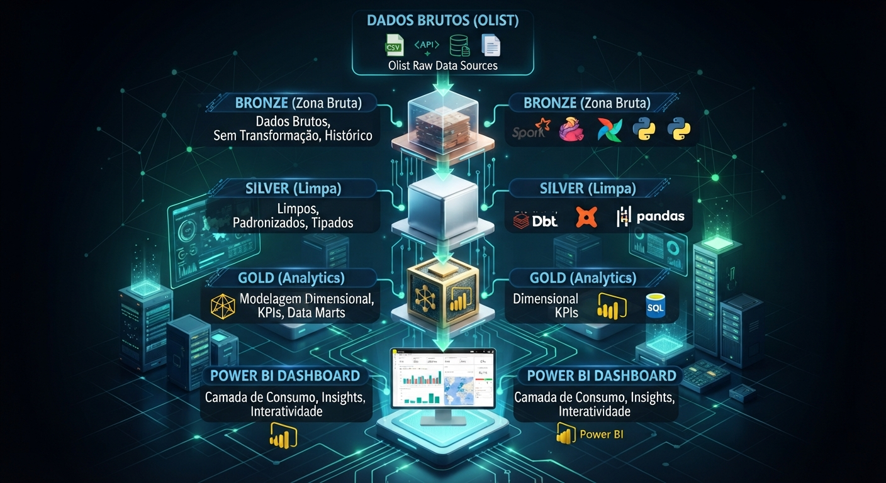
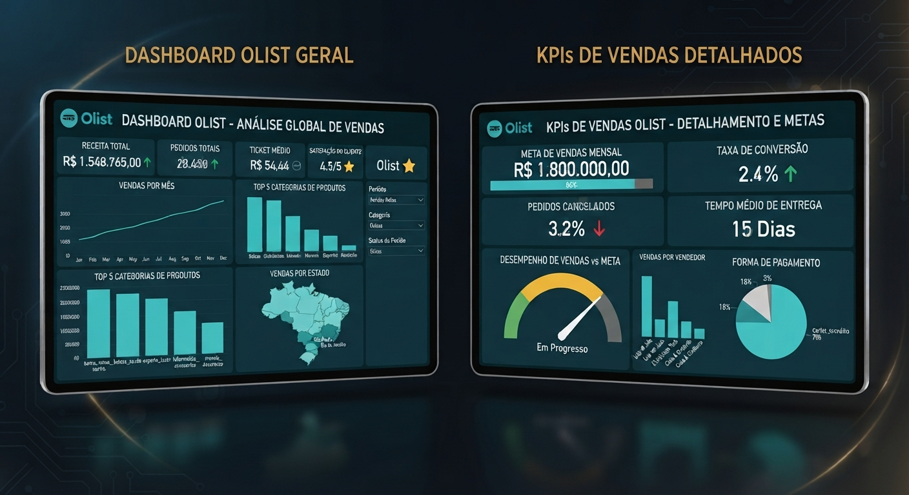
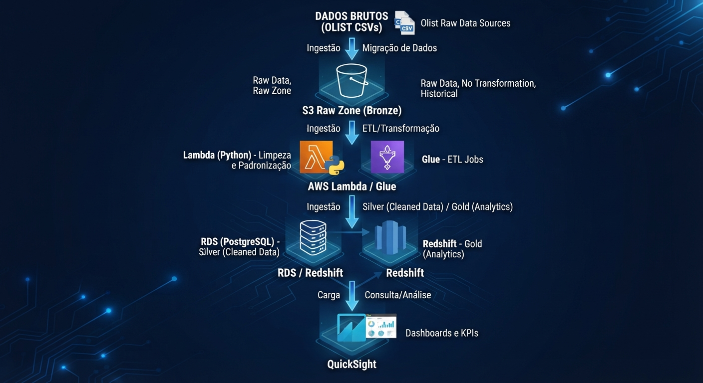

## Pipeline de Dados - Olist

**Meu primeiro projeto de dados. Construí um pipeline completo no Snowflake com arquitetura Medallion e visualizei no Power BI. 
Hoje eu olho pra isso e penso: "e se eu tivesse feito isso na AWS?"**

Esse projeto é a prova de onde eu comecei. E a base para onde eu vou.

## O que é isso

Pipeline completo de dados usando a **arquitetura Medallion** (Bronze, Silver, Gold) no **Snowflake**, com dados de e-commerce da Olist. 
O objetivo era transformar dados brutos em indicadores de negócio (KPIs) visualizados no **Power BI**.

Esse foi meu **primeiro projeto de dados**. Eu tinha nível intermediário em conhecimento em Cloud ainda. Mas construir esse pipeline me ensinou algo que hoje eu uso na AWS: **como pensar em camadas, como transformar dados, como entregar valor pro negócio.**

## A arquitetura (como eu construí)

  

### O que cada camada faz

| Camada | O que acontece | Exemplo real |
|---|---|---|
| **Bronze** | Ingestão dos dados brutos da Olist | CSVs de pedidos, clientes, produtos jogados no Snowflake como estão |
| **Silver** | Limpeza, padronização, deduplicação | Datas no formato certo, CPFs validados, categorias unificadas |
| **Gold** | Modelagem dimensional e views analíticas | Tabela fato de vendas, dimensão de clientes, dimensão de tempo |

---

## Tech Stack

- **Snowflake** — data warehouse em nuvem, storage e compute separados
- **SQL** — criação de tabelas, views, stored procedures e transformações
- **Power BI** — dashboards interativos com KPIs de negócio
- **Arquitetura Medallion** — organização em Bronze, Silver, Gold

---

## Arquivos do projeto

| Arquivo | O que faz |
|---|---|
| `01_Criação_Camadas_Bronze_Silver.sql` | Scripts de preparação dos dados brutos e limpeza |
| `02_Criação_Camada_Gold.sql` | Criação das tabelas consolidadas e views analíticas |
| `03_Consultas_e_Analises.sql` | Consultas de exploração e verificação dos KPIs |
| `portfolio-tecnico-olist.pdf` | Documentação completa da arquitetura, modelagem e KPIs |

---

## KPIs que entreguei

- **Volume de Pedidos por Mês** — sazonalidade e tendência de vendas
- **Distribuição Geográfica de Clientes por Estado** — mapa de penetração de mercado
- **Ticket Médio** — valor médio por pedido
- **Tempo Médio de Entrega** — performance logística
- **Top Categorias de Produtos** — o que mais vende

  

---

## O que esse projeto me ensinou (e que uso hoje na Cloud)

Esse foi meu **primeiro contato** com pipeline de dados. Na época eu não sabia o que era IAM, VPC, ou S3. Mas aprendi coisas que hoje são fundamentais na AWS:

1. **Camadas de dados são camadas de responsabilidade.** Bronze = "não confio nisso ainda". Gold = "pode usar pra decisão". Na AWS, isso se traduz em S3 buckets com políticas de lifecycle diferentes.

2. **SQL é SQL.** O que eu escrevi no Snowflake, eu escrevo no Athena, no Redshift, no RDS. A sintaxe muda pouco. O conceito não muda.

3. **Dashboard sem dados limpos é mentira.** Eu passei 70% do tempo limpando dados em Silver. O Power BI foi o último 10%. Na Cloud, isso se traduz em: **ETL antes de visualização, sempre.**

4. **Snowflake me ensinou sobre separação de storage e compute.** Quando eu vi EC2 + EBS na AWS, eu já entendia o conceito. Snowflake foi meu treino.

---

## Versão Cloud — Onde eu quero levar isso

Esse pipeline hoje está no Snowflake. Mas eu já sei como fazer isso na AWS. E vou fazer.

### Arquitetura futura na AWS:(AWS Cloud Migration)

Este diagrama ilustra o planejamento para a migração e modernização do pipeline de dados, utilizando os serviços nativos da AWS para escalar a análise de dados do projeto Olist.

  

### O que muda:

| Hoje (Snowflake) | Futuro (AWS) | Por quê |
|---|---|---|
| Snowflake (storage + compute) | **S3** (storage) + **Lambda/Glue** (compute) | Mais controle, mais barato, mais Cloud-native |
| SQL puro | **Python + SQL** no Glue | Transformações complexas ficam mais fáceis |
| Power BI | **QuickSight** | Integração nativa com AWS, menos licença |
| Snowflake Tasks | **EventBridge + Lambda** | Orquestração serverless, paga só pelo uso |

### O que eu já sei fazer na AWS (porque fiz nos labs):

- **S3** — criar buckets, versionamento, lifecycle policies (fiz no lab S3)
- **Lambda** — funções serverless (próximo passo)
- **IAM** — roles e policies para acesso seguro entre serviços (fiz em todos os labs)
- **EventBridge** — orquestração de eventos (fiz no lab de observabilidade)
- **QuickSight** — dashboards na AWS (próximo passo)

## Status

- [x] Pipeline Medallion no Snowflake
- [x] SQL de transformação (Bronze → Silver → Gold)
- [x] Dashboard no Power BI com KPIs de negócio
- [x] Documentação técnica completa
- [ ] Migrar para AWS (S3 → Lambda → RDS → QuickSight)
- [ ] Automatizar com EventBridge e IAM roles

## Tecnologias Utilizadas
- **Snowflake:** Armazenamento e processamento de dados em nuvem.
- **SQL:** Limpeza, transformação e modelagem dos dados.
- **Power BI:** Visualização de dados e criação de dashboards.

## Arquitetura do Projeto
- **Camada Bronze:** Ingestão dos dados brutos.
- **Camada Silver:** Limpeza e padronização.
- **Camada Gold:** Modelagem dimensional e criação de views analíticas.

## KPIs de Negócio
O projeto foca em indicadores operacionais:
- Volume de Pedidos por Mês.
- Distribuição Geográfica de Clientes por Estado.
- 

### 🌐 Contato

- 💼 **LinkedIn:** [linkedin.com/in/eliana-diniz](https://www.linkedin.com/in/eliana-diniz)
- 📧 **E-mail:** [eliana.dinizsilva@gmail.com](mailto:eliana.dinizsilva@gmail.com)
- 🐙 **GitHub:** [github.com/Dinizasilva](https://github.com/Dinizasilva)

> *"Eu comecei limpando CSV no Snowflake. Hoje eu provisiono buckets no S3. O pipeline é o mesmo. Só mudou onde ele roda. E quem manda nele."*

### 📄 Documentação Técnica
Para uma visão detalhada da arquitetura, modelagem dimensional e KPIs aplicados, acesse o documento abaixo:
[📥 Visualizar Portfólio Técnico - Olist](Portfolio_Projeto_Olist_v2.pdf)

*Projeto desenvolvido por Eliana Diniz Araújo e Silva como parte da construção de um portfólio de dados.*
