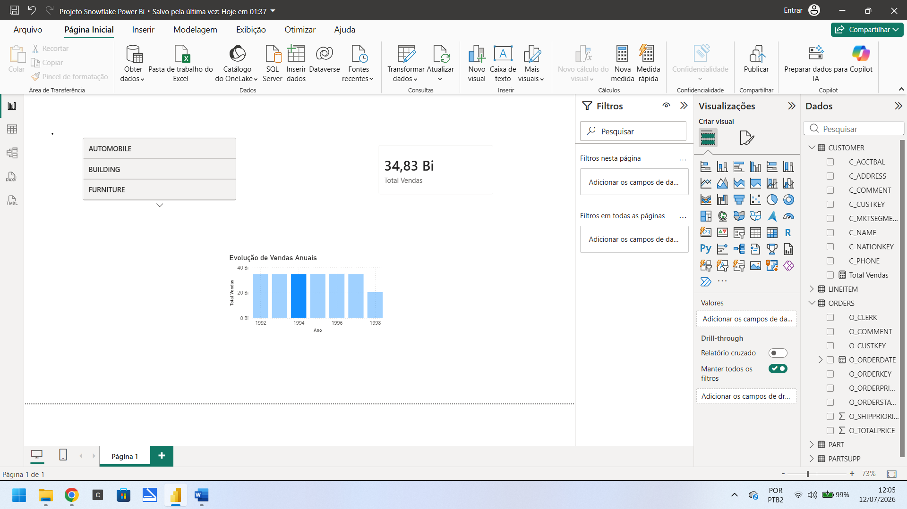

## Pipeline de Dados - Olist

**Meu primeiro projeto de dados. Construí um pipeline completo no Snowflake com arquitetura Medallion e visualizei no Power BI. 
Hoje eu olho pra isso e penso: "e se eu tivesse feito isso na AWS?"**

Esse projeto é a prova de onde eu comecei. E a base para onde eu vou.

## O que é isso

Pipeline completo de dados usando a **arquitetura Medallion** (Bronze, Silver, Gold) no **Snowflake**, com dados de e-commerce da Olist. 
O objetivo era transformar dados brutos em indicadores de negócio (KPIs) visualizados no **Power BI**.

Esse foi meu **primeiro projeto de dados**. Eu tinha nível intermediário em conhecimento em Cloud ainda. Mas construir esse pipeline me ensinou algo que hoje eu uso na AWS: **como pensar em camadas, como transformar dados, como entregar valor pro negócio.**

## A arquitetura (como eu construí)

## 🎯 Objetivo
Este projeto foi desenvolvido para demonstrar habilidades em engenharia e análise de dados, utilizando a arquitetura **Medallion** (Bronze, Silver, Gold) para processar dados de e-commerce e gerar indicadores de negócio (KPIs).

## 🛠️ Tecnologias Utilizadas
- **Snowflake:** Armazenamento e processamento de dados em nuvem.
- **SQL:** Limpeza, transformação e modelagem dos dados.
- **Power BI:** Visualização de dados e criação de dashboards.

## 🏗️ Arquitetura do Projeto
- **Camada Bronze:** Ingestão dos dados brutos.
- **Camada Silver:** Limpeza e padronização.
- **Camada Gold:** Modelagem dimensional e criação de views analíticas.

## 📊 KPIs de Negócio
O projeto foca em indicadores operacionais:
- Volume de Pedidos por Mês.
- Distribuição Geográfica de Clientes por Estado.
- 

## 📂 Organização dos Arquivos
- `01_Criação_Camadas_Bronze_Silver.sql`: Scripts de preparação dos dados.
- `02_Criação_Camada_Gold.sql`: Criação das tabelas consolidadas e da View analítica.
- `03_Consultas_e_Analises.sql`: Consultas de exploração e verificação.
- Markdown
---

### 📄 Documentação Técnica
Para uma visão detalhada da arquitetura, modelagem dimensional e KPIs aplicados, acesse o documento abaixo:
[📥 Visualizar Portfólio Técnico - Olist](Portfolio_Projeto_Olist_v2.pdf)

---
*Projeto desenvolvido por Eliana Diniz Araújo e Silva como parte da construção de um portfólio de dados.*
